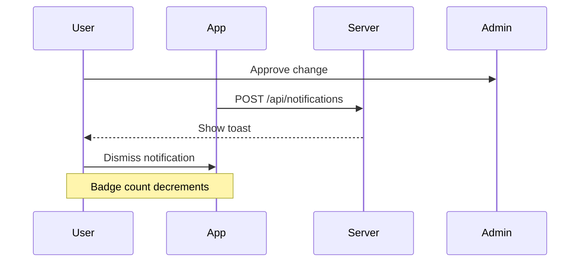

# 👠 **WOW-019** — Notification System
**Status**: **NEW**  
**Priority**: **HIGH**  
**Date**: 2026-05-22  
**Author**: Developer

---

## 📋 Description
Implement an in-app notification system for:
1. **Change Requests (WOW-010)** — Admin approvals for AI-created tasks, offers, project changes
2. **System Events** — New price list valid, project status changes, deadlines
3. **User Mentions** — @username in offers/updates or web chat
4. **Alerts** — Pin validation failed, API limits reached, connection issues
5. **Security & Audit (WOW-016)** — Admin notified of "ACCESS_DENIED" events (worker trying to access other projects)
6. **Git Operations (WOW-013)** — Daily backup success/failure, version save confirmations
7. **AI Agent Tasks (WOW-016)** — Notification when "Morning Dispatch" or "Evening Reconciliation" is complete
8. **TA-Planning (WOW-017)** — TA-Plan validation results, approval from Trafikverket (proxy)
9. **Weather & Safety** — Extreme weather alerts (affecting TA-plans or site work), safety inspection reminders
10. **Procurement (WOW-018)** — Low stock alerts for common materials, delivery confirmations
11. **ID06 & Compliance** — Expiry alerts for worker certifications or company licenses
12. **Chat Handoff** — Notification when one agent dispatches a task to another and it completes
13. **Announcements** — Admin broadcasts, maintenance notices

---

## 🎯 Objectives
- Keep users informed of urgent/approved/rejected changes
- Reduce reliance on email for time-sensitive updates
- Provide real-time feedback for AI operations
- Provide a clear **Notification Indicator** (badge) in both Technical and Simple UIs
- Enable filtering/grouping by type
- Support desktop & mobile views

---

## 🔧 Technical Design

### Storage Options

**Option A: Client-Side (localStorage/IndexedDB)** — Recommended for MVP

```typescript
// Structure:
{
  id: "notif-001",
  type: "approval" | "deadline" | "mention" | "alert" | "announcement" | "security" | "weather",
  severity: "info" | "success" | "warning" | "error",
  title: "Anpassning av Uppgift #1234",
  message: "AI-föreslagen uppgiftskategori... godkänd",
  read: false,
  created_at: "2026-01-16T09:00:00Z",
  expires_at: "2026-01-17T09:00:00Z", // 24h default
  actions: [
    { label: "Godkänn", handler: "...", visible: true },
    { label: "Stäng", handler: "...", visible: true }
  ],
  link?: "/offers/1234" // Navigate here
}
```

**Option B: Server-Side (Redis + WebSocket)** — For enterprise features

- WebSocket push to clients
- Redis queue for high volume
- Persistent across instances

### API Endpoints

```typescript
// GET
GET /api/notifications    // List for current user
GET /api/notifications/count  // Badge count

// POST
POST /api/notifications     // System/admin creates notification
// {
//   type: "approval",
//   data: { approval_id: "...", change_type: "offer_update", ... },
//   title: "Anpassning av Erbjudande #123",
//   message: "AI-föreslagen prissättning godkänd",
//   severity: "info",
//   expires: 86400 // seconds
// }

// User actions
POST /api/notifications/{id}/read   // Mark as read
POST /api/notifications/read-all    // Mark all read
```

### Real-time Updates

```typescript
// WebSocket subscription (if using Option B)
{
  "type": "subscribe",
  "events": ["notification.created", "notification.updated", "notification.deleted"]
}
```

### Server-side triggers

```typescript
// In server code:
function notifyUser(userId: string, notification: any) {
  if (!userId) return;
  // Persist to DB (for audit/synchronization)
  // Send via WebSocket if connected
  // Store client-side for offline
}

// Example: Approve change
await db.pending_changes.update({
  id,
  status: "approved",
  approved_at: now(),
  approved_by: actorId,
  summary: `${summary} — godkänd`,
});
notifyUser(creatorId, {
  type: "approval",
  title: "Anpassning godkänd",
  message: `${change_type} #${target_id} är nu aktiv`,
  link: `/admin?tab=approvals#${id}`,
  severity: "success",
});
```

---

## 🧪 Implementation Plan

### Phase 1: MVP (localStorage)
- [x] localStorage storage
- [x] Toast notifications on creation
- [x] **Badge count in Navigation** (MenuBar and SimpleNavRail indicator)
- [x] Inbox view in Settings
- [x] Filter by type/severity
- [x] Mark as read functionality
- [x] Admin API endpoint
- [x] Integration with pending-changes
- [x] **Integration with Audit Logger** (log security violations as high-severity notifications)
- [ ] **Integration with Git Backend** (log backup results)
- [x] **Integration with Weather Service** (extreme weather triggers)
- [x] **Integration with ID06/Supply Agents** (certification and material alerts)

### Phase 2: Real-time (WebSocket)
- [ ] WebSocket push notifications
- [ ] Reconnect handling
- [ ] Offline queue
- [ ] Mobile push (FCM/APNS)
### Phase 3: Advanced Features
- [ ] Email fallback
- [ ] SMS alerts (critical only)
- [ ] Notifications preferences panel
- [ ] "Do not disturb" mode
- [ ] Notification analytics

---

## 🧩 Integration Points

### Change Request System (WOW-010)
```typescript
// When admin approves change:
await fetch("/api/notifications", {
  method: "POST",
  body: JSON.stringify({
    userId: creatorId,
    type: "approval",
    title: "AI-anpassning av prislängd",
    message: "Prislängd för grundarbeten har justerats",
    severity: "info",
    link: `/offers/1234`,
  }),
});
```

### Price List Validations
```typescript
// When price list expires:
POST /api/notifications
{
  userId: "active_users", // Broadcast to all active users
  type: "alert",
  title: "Prislängd om 7 dagar",
  message: "Prislistan 'Grundarbeten 2024' löper ut 2025-12-31",
  severity: "warning",
  link: "/pricing",
}
```

### Deadlines & Reminders
```typescript
// Every 6 hours, check pending deadlines:
const overdue = await db.offers.where('created_at').belowNow().toArray();
overdue.forEach(o => {
  notifyUser(creatorId, {
    type: "deadline",
    title: "Offert förlöpt",
    message: `Erbjudande ${o.id} skapades ${o.created_at} med giltighetstid 30 dagar`,
    severity: "error",
    link: `/offers/${o.id}`,
  });
});
```

---

## 💅 UI/UX Considerations

### Toast Notifications
```typescript
// Position: Top-right or bottom-left
// Behavior: Auto-dismiss (5-10s) or manual close
// Types:
//   info    - Gray background, no icon
//   success - Green checkmark
//   warning - Yellow exclamation
//   error   - Red circle with exclamation
```

### Notification Panel
```typescript
// Location: Navigation drawer or Settings
// Filter: All | Pending | Unread | Mentions
// Sort: Newest first
// Actions: Read all, Clear all, Export to CSV
```

### Preferences Modal
```typescript
// Location: Settings → Notifications
// Toggles:
//   ✓ Approvals & rejections
//   ✓ Deadlines & reminders
//   ✓ AI suggestions
//   ✓ User mentions (@)
//   ✗ System announcements
//   ✗ Email fallback
```

---

## 📊 Example Notifications

### Approval Granted
```json
{
  "type": "approval",
  "severity": "success",
  "title": "Anpassning godkänd ✓",
  "message": "AI-föreslagen uppgiftskategori har ändrats till 'Elektriker',",
  "link": "/admin?tab=approvals",
  "expires_at": "2026-01-17T09:00:00Z"
}
```

### Price List Expiring
```json
{
  "type": "alert",
  "severity": "warning",
  "title": "Prislängd löper ut snart ⚠️",
  "message": "Prislistan 'Grundarbeten 2024' kommer att löpa ut om 7 dagar.",
  "link": "/pricing",
  "expires_at": "2026-02-01T09:00:00Z"
}
```

### User Mention
```json
{
  "type": "mention",
  "severity": "info",
  "title": "Ole Andersson nämnt dig",
  "message": "Har läst ditt svar i Erbjudande #456",
  "link": "/offers/456",
  "expires_at": "2026-01-17T09:00:00Z"
}
```

### System Alert
```json
{
  "type": "alert",
  "severity": "error",
  "title": "API-limit nått ✋",
  "message": "Din API-nyckel har nått dagens gräns för kallstart. Vänligen försöker igen senare.",
  "link": "/settings/api",
  "expires_at": "2026-01-16T23:59:59Z"
}
```

---

## 🧪 Testing Checklist

```bash
# Create notification via API
curl -X POST https://wayofwork.test/api/notifications \
  -H "Authorization: Bearer $(cat ~/.wop-token)" \
  -H "Content-Type: application/json" \
  -d '{
    "userId": "current_user",
    "type": "test",
    "severity": "info",
    "title": "Testnotification",
    "message": "Detta är en testnotification"
  }'

# Get user notifications
curl https://wayofwork.test/api/notifications \
  -H "Authorization: Bearer $(cat ~/.wop-token)"

# Mark as read
curl -X POST https://wayofwork.test/api/notifications/test-001/read \
  -H "Authorization: Bearer $(cat ~/.wop-token)"
```

---

## 🍏 Related Tickets

- 👠 **WOW-019** — Notification System (this)
- 👠 **WOW-010** — Change Request / Human-in-the-Loop
- 👠 **WOW-020** — Bug Report System (next ticket)
- [ ] WOW-XXX — Real-time notifications (WebSocket)
- [ ] WOW-YYY — Mobile push notifications

---

## 📝 Notes

Ticket renumbered from 000 → 019. Related bug report system will be WOW-020 following sequential numbering.

---

## 🆙 Version History

| Version | Date | Description | Author |
|---------|------|-------------------------|--------|
| 1.0 | 2026-01-16 | Initial spec | Developer |
| 1.1 | 2026-01-16 | Renumbered to 019 | System |
| 1.2 | 2026-05-22 | Expanded categories and UI indicator | AI |

---

**Status**: NEW — Ready for implementation  
**Priority**: HIGH — Essential for WOW-010 workflow  
**Dependencies**: None  
**Blockers**: None

---

## 🧪 Demo Flow



---

## 🍏 Implementation Checklist

```bash
# Step 1: Create notification component
# File: src/components/NotificationToast.tsx
# Features: Auto-dismiss, action buttons, filtering

# Step 2: Create admin API endpoints
# File: server/endpoints/notifications.ts
# GET: list, count
# POST: create
# GET/{id}: single
# POST/{id}/read: mark as read

# Step 3: Wire WOW-010 approval
# Location: server/admin/pending-changes-api.ts 
# Add trigger: approve() → POST notification

# Step 4: Add badge to Navigation
# Location: src/components/Navigation.tsx
# Show unread count in bell icon
```

---

## 🔮 Future Enhancements

- [ ] Notification center (unified inbox)
- [ ] Email fallback for critical
- [ ] SMS for emergency
- [ ] Notification snooze
- [ ] "Read later" queue
- [ ] Notification groups by project

---

**END OF TICKET**
