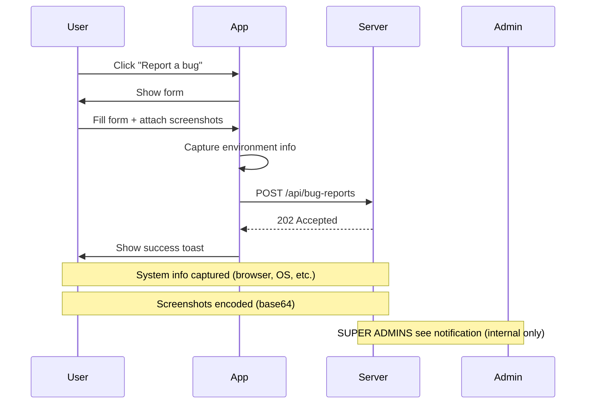

# 👠 **WOW-020** — Bug Report & Feature Request System
**Status**: **NEW**  
**Priority**: **HIGH**  
**Date**: 2026-05-22  
**Author**: System  
**Assignee**: SUPER ADMINS (Direct)

---

## 📋 Description
Implement an in-app bug report and feature request system where any user can submit feedback that is **directly visible to SUPER ADMINS** without notifications going to end users.

The system should:
- Allow users to report bugs (with screenshots, reproduction steps, expected vs actual behavior)
- Allow users to request new features or improvements
- Support categorization (bug, feature, security, enhancement)
- Include system info (browser, OS, device, environment)
- Route to SUPER ADMINS
- Track status: pending → in-review → fixed → closed

---

## 🎯 Objectives
1. [x] **User Feedback** — Capture bug reports and feature requests easily
2. [x] **SUPER ADMIN Visibility** — All submissions visible in admin panel only
3. [x] **Categorization** — Tag as bug, feature, security, enhancement
4. [x] **Status Tracking** — pending → In Review → Fixed/Implemented → Closed
5. [x] **Prioritization** — Critical, High, Medium, Low
6. [x] **Screenshot Capture** — Automatic or manual screenshot attachment
7. [ ] **Threaded Replies** — Discussion capability
8. [x] **SUPER ADMIN Actions** — Assign, comment, close, escalate

---

## 🔧 Technical Design

### Database Schema

```sql
CREATE TABLE bug_reports (
  id                     UUID PRIMARY KEY DEFAULT gen_random_uuid(),
  user_id                TEXT NOT NULL,                      -- Logged-in user
  username               TEXT,                               -- User display name
  title                  TEXT NOT NULL,                      -- "X crashes on Y"
  category               TEXT NOT NULL,                      -- 'bug' | 'feature' | 'security' | 'enhancement'
  severity               TEXT NOT NULL,                      -- 'critical' | 'high' | 'medium' | 'low'
  description            TEXT NOT NULL,                       -- User's report
  expected_behavior      TEXT,                               -- What should happen
  actual_behavior        TEXT,                               -- What actually happened
  steps_to_reproduce     TEXT[],                             -- ["1. Go to...", "2. Click..."]
  environment            JSONB,                              -- {"browser": "Chrome 121", "os": "Windows 11", ...}
  screenshots            TEXT[],                             -- Base64 or URL
  video_url              TEXT,                               -- Optional Giphy/YouTube link
  reproduction_rate      TEXT DEFAULT "often",               -- "always" | "often" | "sometimes"
  is_security_issue      BOOLEAN DEFAULT false,
  is_duplicate_of        TEXT,                               -- Reference to existing report
  status                 TEXT DEFAULT 'pending',             -- 'pending' | 'in-review' | 'acknowledged' | 'fixed' | 'won't-fix' | 'closed'
  assigned_to            TEXT[],                             -- SUPER ADMIN user_ids
  status_reason          TEXT,                               -- "Won't fix: not feasible"
  comments               TEXT[],                             -- Threaded discussion
  created_at             TIMESTAMPTZ DEFAULT NOW(),
  updated_at             TIMESTAMPTZ DEFAULT NOW(),
  acknowledged_at       TIMESTAMPTZ,
  status_changed_at      TIMESTAMPTZ,
  fixed_in_version       TEXT,
  closed_by              TEXT,
  closed_at              TIMESTAMPTZ,
  notified_user          TIMESTAMPTZ,                        -- When user was notified of update
  notifications_count    INTEGER DEFAULT 0,
  upvotes                INTEGER DEFAULT 0,                   -- Community votes for priority
  labels                 TEXT[],                             -- "urgent" | "regression" | "ui" | "data"
);

CREATE INDEX idx_bug_user_id ON bug_reports(user_id);
CREATE INDEX idx_bug_status ON bug_reports(status);
CREATE INDEX idx_bug_category ON bug_reports(category);
CREATE INDEX idx_bug_severity ON bug_reports(severity);
CREATE INDEX idx_bug_assigned ON bug_reports(assigned_to) WHERE assigned_to IS NOT NULL;
CREATE INDEX idx_bug_created ON bug_reports(created_at DESC);
```

### API Endpoints

```typescript
// List bug reports (SUPER ADMIN only)
GET /api/admin/bug-reports               // Pagination, filters
GET /api/admin/bug-reports/summary       // Statistics

// Get single report
GET /api/admin/bug-reports/{id}

// Create new report (any user)
POST /api/bug-reports
// Creates with user_id, system info
// {
//   title: "Crashes on export",
//   category: "bug",
//   severity: "high",
//   description: "After clicking Export, app crashes",
//   expected_behavior: "PDF downloads",
//   actual_behavior: "Application closes unexpectedly",
//   steps_to_reproduce: ["Go to Offers", "Select report", "Click Export"],
//   system_info: {...} // Auto-captured
// }

// Update status (SUPER ADMIN only)
PUT /api/admin/bug-reports/{id}
{
  status: "acknowledged",
  assigned_to: ["admin-01"],
  status_reason: "Under investigation",
}

// Add comment (SUPER ADMIN only)
POST /api/admin/bug-reports/{id}/comments
{
  text: "Can you reproduce this?"
}

// Close report (SUPER ADMIN only)
PUT /api/admin/bug-reports/{id}/close
{
  status: "closed",
  status_reason: "Confirmed fixed in build 2.4.2",
  notified_user: true,
}

// Webhook for SUPER ADMIN internal notifications
POST /api/admin/bug-reports/{id}/notify
{
  userIds: ["admin-01", "admin-02"],
  message: "New bug report for review"
}
```

---

## 🧩 UI Components

### Report Form (for users)

```typescript
interface BugReportForm {
  // User input fields
  title: string;
  category: "bug" | "feature" | "security" | "enhancement";
  severity: "critical" | "high" | "medium" | "low";
  description: React.FormChild | { text, type?: 'text'|'image'|'video' };
  expectedBehavior: string;
  actualBehavior: string;
  stepsToReproduce: string[];
  systemInfo: { browser, os, device, version, ... }; // Auto-captured
  
  // System info (auto-captured before submit)
  environment: {
    runtime: string,
    channel: string,
    userAgent: string,
    screenResolution: { width, height },
    timezone: string,
    language: string
  }
}
```

### Submission Process



### SUPER ADMIN Dashboard

```typescript
interface AdminColumn {
  status: "pending" | "in-review" | "acknowledged" | "fixed" | "closed";
  severity: "critical" | "high" | "medium" | "low";
}

// Kanban or list view for SUPER ADMINS only
<ReportColumnList>
  <Column title="Pending" status="pending">
    {reports.filter(r => r.status === "pending").map(r => <ReportCard report={r} key={r.id} />)}
  </Column>
</ReportColumnList>
```

---

## 📊 Workflow States

### State Transitions
```
pending → in-review → acknowledged → fixed → closed
                                      ↓
                                won't-fix → closed
```

### SUPER ADMIN Actions

| Action | Result | Notification |
|--------|--------|--------------|
| Acknowledge | status=acknowledged | Notify SUPER ADMINS only |
| Assign | assigned_to=admin-XXX | Add as co-author |
| Ask questions | add comment | SUPER ADMINS only |
| Mark duplicate | is_duplicate_of=id | Link to existing |
| Fix confirmation | status=fixed | Link to release notes |
| Won't fix | status=won't-fix | Provide reason |
| Close | status=closed | End discussion |

---

## 💅 UI/UX Considerations

### Report Form Modal

```typescript
<Modal title="Rapportera ett problem">
  <form onSubmit={reportBug}>
    <Input label="Rubrik" placeholder="Exempel: Appen stänger..." value={title} />
    <Select label="Kategori" value={category} options={["bug", "feature", "security", "enhancement"]} />
    <Select label="Allvår" value={severity} options={["critical", "high", "medium", "low"]} />
    
    <Textarea label="Beskrivning" value={description} />
    <Textarea label="Förväntat beteende" value={expectedBehavior} />
    <Textarea label="Det som hände" value={actualBehavior} />
    
    <StepsEditor label="Åtgärdssteg" value={stepsToReproduce} />
    <MultipleFileUpload label="Skärmbilder" accept=".png,.jpg,.jpeg,.screenshot" />
    <VideoLinkInput label="Länk till video" placeholder="Giphy eller YouTube-länk" />
    
    <Button type="submit">Rapportera</Button>
  </form>
</Modal>
```

### Admin Dashboard View

```typescript
<KanbanColumns>
  <Column title="Väntar på granskning" status="pending">
    {reports.filter(r => r.status === "pending").map(r => <ReportCard report={r} key={r.id} />)}
  </Column>
  <Column title="Under granskning" status="in-review">
    {reports.filter(r => r.status === "in-review").map(r => <ReportCard report={r} key={r.id} />)}
  </Column>
</KanbanColumns>
```

### Report Card Component

```typescript
type ReportCardProps = {
  report: BugReport;
};

function ReportCard({ report }: ReportCardProps) {
  const { title, category, severity, description, created_at, user_id } = report;

  return (
    <Card className={`p-3 border-2 ${severity === "critical" ? "border-red-500" : "border-gray-300"}`}>
      <div className="flex justify-between items-start">
        <div className="flex-1 min-w-0">
          <h5 className="font-medium text-xs text-white">{title}</h5>
          <p className="text-[#858585] text-xs">{description.substring(0, 150)}...</p>
          <div className="flex gap-2 mt-2 text-[#585858]">
            <Badge>{category}</Badge>
            <Badge>{severity}</Badge>
          </div>
        </div>
        
        <div className="shrink-0 flex gap-2">
          <Button size="sm" onClick={() => handleStatusChange("acknowledged")}>
            Bekräfta
          </Button>
        </div>
      </div>
    </Card>
  );
}
```

---

## 🧪 Testing Checklist

```bash
# Test user submission
curl -X POST https://wayofwork.test/api/bug-reports \
  -H "Authorization: Bearer $(cat ~/.wop-token)" \
  -d '{
    "title": "Test report",
    "category": "bug",
    "severity": "low",
    "description": "This is a test",
    "expected_behavior": "Should work",
    "actual_behavior": "Does nothing"
  }'

# SUPER ADMIN gets list (internal dashboard only)
curl https://wayofwork.test/api/admin/bug-reports \
  -H "Authorization: Bearer $(cat ~/super-admin-token)"

# Mark as acknowledged (SUPER ADMIN only)
curl -X PUT https://wayofwork.test/api/admin/bug-reports/{id} \
  -H "Authorization: Bearer $(cat ~/super-admin-token)" \
  -d '{"status": "acknowledged"}'
```

---

## 🔮 Future Enhancements

- [ ] Community voting for feature requests (SUPER ADMIN sees only)
- [ ] Impact scoring (how many users affected)
- [ ] Trend analysis (bugs recurring)
- [ ] Integration with GitLab/Jira
- [ ] Public status page (external)

---

## ⚠️ Security Considerations

- Only SUPER ADMINS can see full reports
- Users can only see their own reports
- Sensitive info sanitized before logging
- Report IDs are non-guessable (UUID)
- HTTPS required for all endpoints
- No end-user notifications (internal only)

---

## 🍏 Related Tickets

- 👠 **WOW-019** — Notification System (for internal SUPER ADMIN notifications)
- 👠 **WOW-020** — Bug Report System (this ticket)
- 👠 **WOW-010** — Change Request / Human-in-the-Loop

---

## ✅ Acceptance Criteria

✅ [x] User can submit bug report with screenshots  
✅ [x] System captures environment info automatically  
✅ [x] SUPER ADMINS see all reports in admin panel  
✅ [x] Reports can be filtered by category/severity  
✅ [x] Status tracking works correctly  
✅ [x] Duplicate reports can be marked  
✅ [x] Critical bugs get special handling  

---

## 📆 Timeline Estimate
- **Frontend Form**: 2 hours
- **Admin Dashboard**: 4 hours
- **API Endpoints**: 3 hours
- **Testing**: 2 hours
- **Total**: 1 day

---

## 🎯 Expected Benefits

✅ Users can easily report issues  
✅ SUPER ADMINS get structured feedback  
✅ Duplicate reports reduced via dedup  
✅ Track resolution time and trends  
✅ Build trust through responsive feedback  

---

## 📋 Notes

- This ticket will be renumbered from 099 → 020
- Date corrected to May 22, 2026 (current date)
- Notifications go to SUPER ADMINS only (no end-user alerts)
- Reports are visible only in admin panel

---

**Status**: NEW — Ready for implementation  
**Priority**: HIGH — User feedback mechanism  
**Dependencies**: WOW-019 (internal notifications for SUPER ADMINS)  
**Blockers**: None  

---

**END OF TICKET**